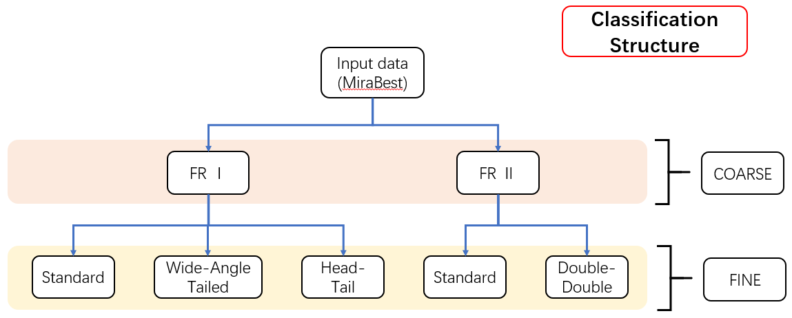
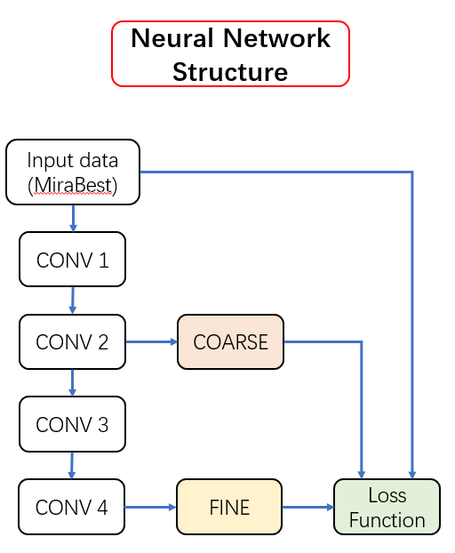
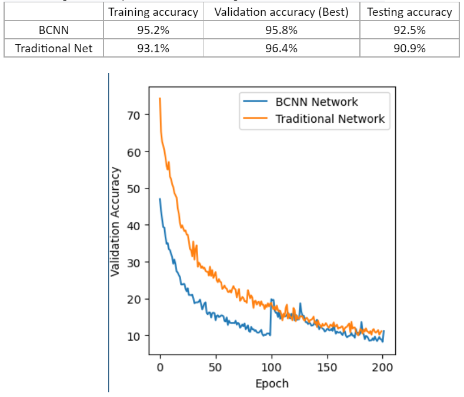

# Classification of Radio Galaxies via BCNN

## Structure

Structure of hierarchical Fanaroff-Riley classification of radio galaxies

Structure of 

<!-- 

 -->

## Loss Function 

Detailed loss functions are available [here](./attachments/NewLossFunction.pdf)

## Results
Training loss are as following.

<!--  -->
