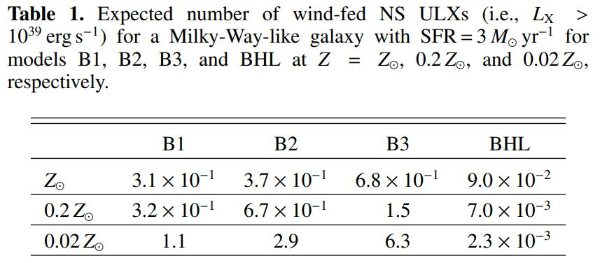
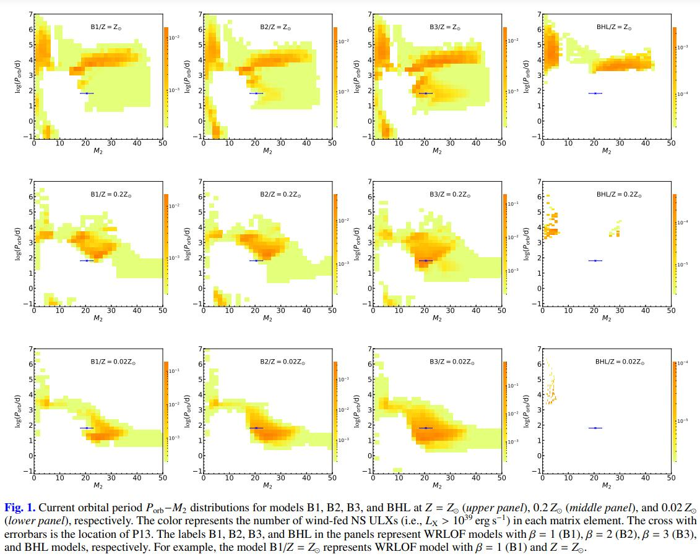
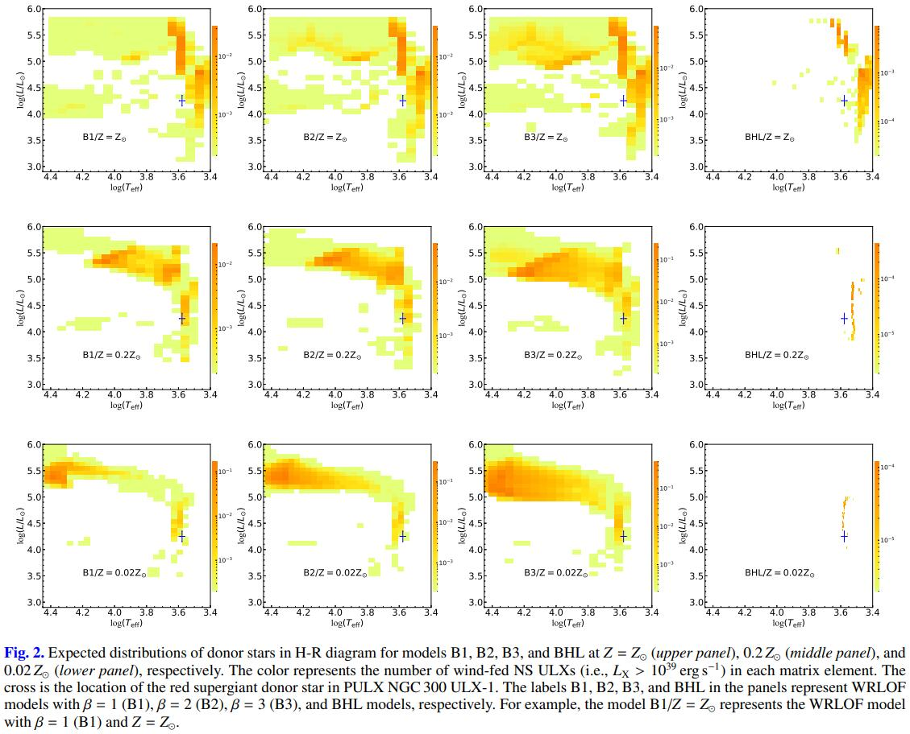

# Ultra-luminous X-ray Source (ULX)

The basic introduction slides could be found in this [pdf](./attachments/ULXslides.pdf) file (Chinese).
More specific details could be obtained via my graduate [thesis](attachments/thesis.pdf) (Chinese).

## [Accreting Neutron Star with Wind Roche-lobe Overflow](attachments/ULX_neutron.pdf)

This article had been published in [A&A](https://doi.org/10.1051/0004-6361/202140792). This paper focus on the Neutron Star ULXs and firstly displayed the binary parameters of Wind Roche-lobe Overflow system.

### DOI:
[https://doi.org/10.1051/0004-6361/202140792](https://doi.org/10.1051/0004-6361/202140792)

### Abstract:
Very recently, wind Roche-lobe overflow (WRLOF) has been suggested as a possible mass transfer mechanism for ultra-luminous X-ray sources (ULXs) and, to date, two neutron-star (NS) ULXs (i.e., NGC 7793 P13 and NGC 300 ULX-1) are remarkable and
hard to understand in the current, usual RLOF picture. In this work, we test if the two sources could fit into the WRLOF paradigm.
By using an evolutionary population synthesis (EPS) method, we modeled the population of NS ULXs with (super)giant donors,
taking the WRLOF accretion mode into account. We find that the population of wind-fed NS ULXs in the WRLOF mode is distinct
in numbers and binary parameters from that in the traditional Bondi-Hoyle-Lyttleton (BHL) mode, and it is strongly metallicity
dependent. The number of NS ULXs with (super)giant donors can be enhanced greatly, by one or two orders of magnitude, depending
on the metallicity adopted. Sources with massive (∼ 15 − 40 M⊙) (super)giant donors dominate wind-fed NS ULXs in the very low
metallicities, while sources in near solar cases are dominated by a red supergiant (RSG) with a lower mass M2 < 10 M⊙ instead.
Moreover, the two NS ULXs can be well reproduced in the WRLOF paradigm, which significantly enriches our understanding of the
nature of ULXs and the population. We also present the current distributions of binary parameters of wind-fed NS ULXs, which may
be further testified by future high-resolution optical and X-ray observations of these populations.


### Table and Figures

<!--  -->





<!-- Expected number of wind-fed NS ULXs (i.e., $L_X >  10^{39} erg/s^{−1}$) for a Milky-Way-like galaxy with $SFR = 3 M_⊙ yr^{−1}$ for models B1, B2, B3, and BHL at $Z = Z_⊙$, $0.2 Z_⊙$, and $0.02 Z_⊙$, respectively. -->


## [Population Synthesis on ULXs in Ring Galaxies](attachments/ULX_ring.pdf)

### Simulation Program 
There are 4 file folders in this project. All the codes are available on [github](https://github.com/wonderingmark123/). More detailed documents for python files can be downloaded here([Main.py](attachments/README.pdf) & [utils.py](attachments/README_utils.pdf)) 

#### Fortran0415

modified fortran code BSE

- popbin_mine.f: main function for POPBIN program, get the evolution details of every stage.
- popbin_hanchen.f: POPBIN program. This program is for calculating the birth rate of each binary systems when the Neutron star born.
More details are available in README_BSE, README_SSE and README_NEW.

The history of modified could be found in ``./Fortran0415/note.txt``.

You can run the program on bash:
```bash
make popbin
./popbin # run popbin program, main program is popbin_mine.f
```

#### FortranOri

This is the original BSE code for backup. There are few demos. You can run them on bash following few steps below:
```bash
sudu apt install make gfortran # install environment
make popbin bse sse

./popbin # run popbin program, main program is popbin.f which generates plenty of binaries in this program.
./bse # run bse program, main program is bse.f which generates one particular binary
./sse # run sse program, main program is sse.f which generates one particular single star.
```
#### Python

This file folder contains all the analysis python program. More details could be found in its document: ``./python/README.md``.

#### Data

This is the file folder for saving data and will not be uploaded to github. 

##### PaperPlotData

This is the file folder for saving mesa data and popbin data with label being ``1117``.

- 1117_paper.mat: popbin data with label being ``1117``
- hanchen_first_neutron1124.out: popbin result for mesa plot.
- Lx_N1207.npy: selected data from mesa output data.


