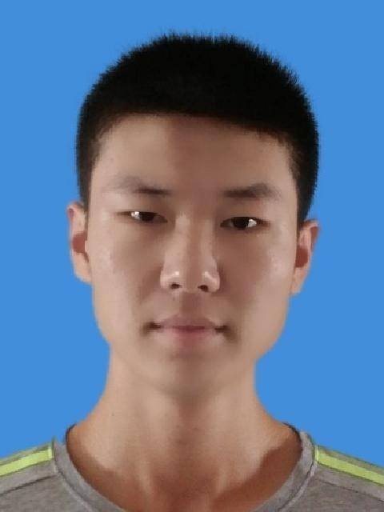

# Haotian Song (宋昊天)

{ .profile-photo }

**Physics PhD candidate · National University of Singapore** 
Centre for Quantum Technologies · Singapore

I work on quantum simulation with ultracold lithium-6 fermions in disordered two-dimensional optical lattices, supervised by Prof. Kai Dieckmann. My research combines experimental quantum hardware, precision optics, laser stabilization and scientific computing. Earlier work spans computational imaging, deep learning and astrophysical population synthesis.

[Email](mailto:haotian.song@u.nus.edu){ .md-button .md-button--primary }
[Academic CV](attachments/Haotian_Song_Academic_CV.pdf){ .md-button }
[GitHub](https://github.com/Haotian-Song){ .md-button }
[ORCID](https://orcid.org/0000-0002-9606-4628){ .md-button }

## Research

- **Ultracold atoms and quantum simulation.** Building and operating a lithium-6 platform for fermions in disordered 2D optical lattices, including lattice loading, confinement and calibration. [Doctoral research](quantum.md).
- **Precision optics and experimental control.** Optical lattices, laser frequency and intensity stabilization, absorption imaging, optical transport and feedback systems.
- **Computational imaging.** Deep-learning ghost imaging at 0.8% Nyquist sampling and correlated speckle patterns. [Computational imaging research](CGI.md).
- **Scientific modeling.** Population synthesis of neutron-star ultraluminous X-ray sources with wind Roche-lobe overflow. [Earlier astrophysics work](ULX.md).

## Education

**National University of Singapore — PhD in Physics, in progress** 
January 2022 – January 2027 (expected) · Centre for Quantum Technologies 
Research: quantum simulation of fermions in disordered 2D optical lattices. Supervisor: Prof. Kai Dieckmann.

**Xi'an Jiaotong University — BSc in Physics (Honors)** 
September 2017 – June 2021 · Tsien Hsue-shen Talented Program (top 10%) 
GPA: 89.37/100.

Additional academic experience includes the University of Manchester, Texas A&M University and the Peking University School of Physics Summer School.

## Publications and presentations

My published research covers deep correlated speckles (*Photonics Research*, 2024), computational ghost imaging (*Optics Communications*, 2022; first author) and neutron-star ultraluminous X-ray sources (*Astronomy & Astrophysics*, 2021).

[Full publication list and conference presentations](publications.md)

## Technical skills

**Experimental systems:** ultracold atoms, lithium-6 Fermi gases, molecular BEC preparation, ultrahigh vacuum, Feshbach resonance control, absorption imaging, band mapping and amplitude modulation spectroscopy.

**Optics and control:** optical alignment, beam shaping, PDH and modulation-transfer locking, AOM/EOM control, PZT feedback, speckle projection and precision calibration.

**Computing:** Python, MATLAB, LabVIEW, Zemax, Mathematica, Fortran, C++, Linux and LaTeX; image processing, numerical fitting, Monte Carlo simulation and deep-learning reconstruction.

## Selected awards

- Outstanding Graduate Thesis Award (top 1%), Xi'an Jiaotong University, 2021.
- Everest Scholarship, Xi'an Jiaotong University, 2021 and 2018.
- First Prize, 5th Chinese Undergraduate Physics Experiment Competition, 2019.
- First Prize, Contemporary Undergraduate Mathematical Contest in Modeling, Shaanxi Province, 2018.

## Contact

I am interested in research and development opportunities in quantum technology, photonics and semiconductor equipment.

[haotian.song@u.nus.edu](mailto:haotian.song@u.nus.edu) · [GitHub](https://github.com/Haotian-Song) · [ORCID: 0000-0002-9606-4628](https://orcid.org/0000-0002-9606-4628)
